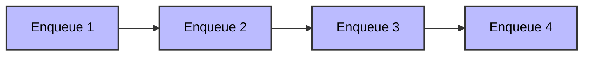

# Queue

- A queue is a linear data structure that follows the **First-In-First-Out (FIFO)** principle, where elements are added at the rear (end) and removed from the front (beginning).
- The first element added to the queue will be the first one to be removed.
- Queues can be implemented using arrays or objects (classes) in programming.

## Real-life Example

- A **queue at a ticket counter**, where people join at the end and are served from the front in order.
- **Vehicles at a traffic signal**, where the first vehicle to arrive is the first to leave when the light turns green.
- **Printing jobs in a printer queue**, where documents are printed in the order they are submitted.
- **Customer service call center**, where calls are answered in the order they are received.

## Applications

- Background tasks
- Uploading Resources
- Printing/Task processing

## Queue Implementation

- Queues can be implemented using **arrays**, where elements are added at the end using `push` and removed from the front using `shift`. [Queue using Array - Example](/Data-Structures/queue/queueArray.js)
- Queues can also be implemented using **objects (or classes)**, where you manually manage the front and rear pointers and provide methods for enqueue and dequeue operations. [Queue using Linked List - Example](/Data-Structures/queue/queueLinkedList.js)
