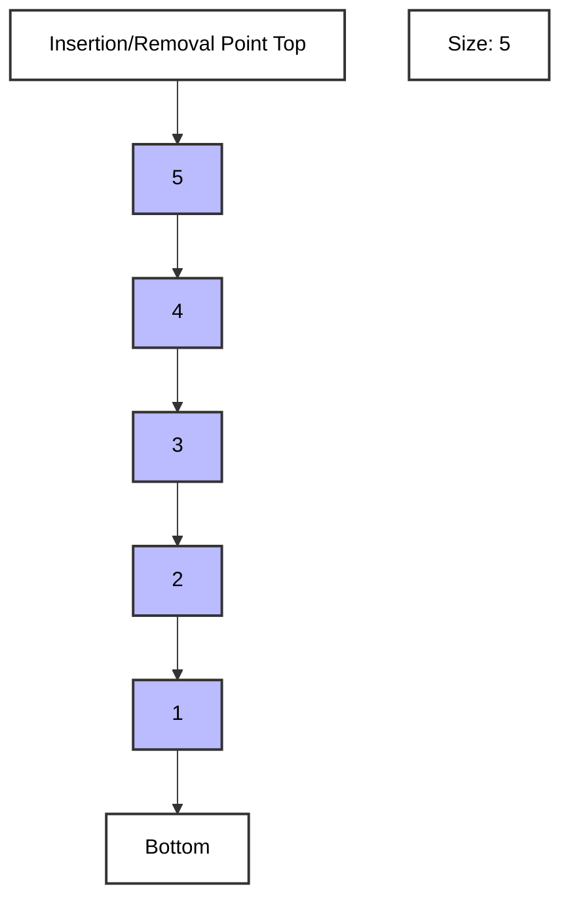

# Stack

- A stack is a linear data structure that follows the **Last In, First Out (LIFO)** principle. This means that the last element added to the stack will be the first one to be removed.
- Insertion and removal of elements happen at the **top** of the stack.

## Stack Visualization

## Real-life Example

A common real-life example of a stack is a **stack of plates**. When you **add a plate** to the stack, you place it **on top**. When you need a plate, you take the one from the **top**. The **last plate added** is the **first one to be removed**, following the LIFO principle.

## Applications

- expression evaluation
- backtracking algorithms
- function call management in programming language
