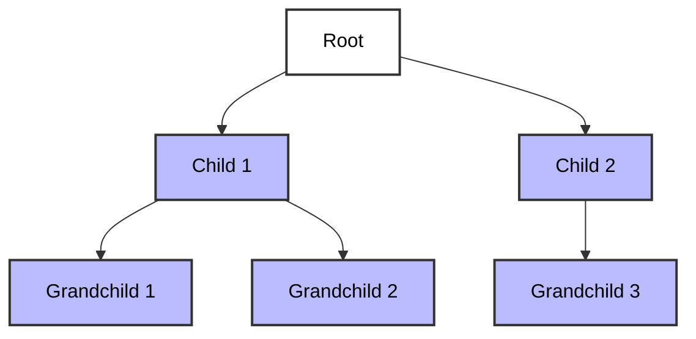

# Trees

- A tree is a **hierarchical data structure (non-linear)** made up of **nodes**. Each node can have zero or more child nodes. There is exactly one **root node** (the topmost node). Each child node has exactly one parent, except for the root node, which has no parent.
- Trees are used to represent relationships where data is organized in a branching manner.
- In short, a tree is a non-linear data structure with a **parent/child relationship**.

## Tree Terminology

- **Root** - The Top node in a tree.
- **Child** - A node directly connected to another node when moving away from the Root.
- **Parent** - The converse node of a child.
- **Siblings** - A group of nodes with the same parent.
- **Leaf** - A node with no children.
- **Edge** - The connection between one node and another.

## Real-life Example

- A **computer file system**, where **folders** contain **sub-folders** and **files**, starting from a **root directory**.
- A **school hierarchy**, where the **principal** is at the top, followed by **departments**, then **teachers**, and **students**.
- A **book’s table of contents**, where **chapters** branch into **sections** and **subsections**.

## Applications

- HTML Dom
- Network Routing
- Abstract Syntax Tree
- Artificial Intelligence
- Folders in Operating Systems
- Computer File Systems
