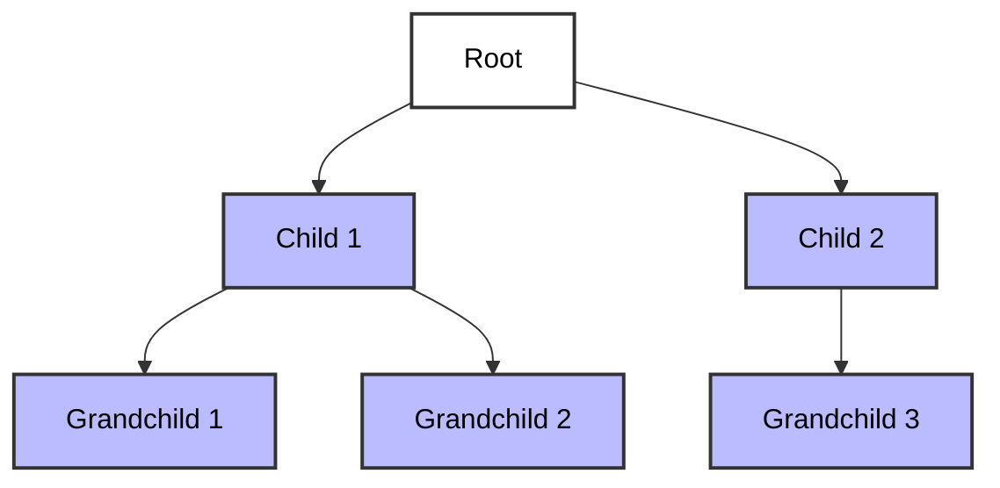

# Trees

- A tree is a **hierarchical data structure (non-linear)** made up of **nodes**. Each node can have zero or more child nodes. There is exactly one **root node** (the topmost node). Each child node has exactly one parent, except for the root node, which has no parent.
- Trees are used to represent relationships where data is organized in a branching manner.
- In short, a tree is a non-linear data structure with a **parent/child relationship**.

## Tree Terminology

- **Root** - The Top node in a tree.
- **Child** - A node directly connected to another node when moving away from the Root.
- **Parent** - The converse node of a child.
- **Siblings** - A group of nodes with the same parent.
- **Leaf** - A node with no children.
- **Edge** - The connection between one node and another.

## Real-life Example

- A **computer file system**, where **folders** contain **sub-folders** and **files**, starting from a **root directory**.
- A **school hierarchy**, where the **principal** is at the top, followed by **departments**, then **teachers**, and **students**.
- A **book’s table of contents**, where **chapters** branch into **sections** and **subsections**.

## Applications

- HTML Dom
- Network Routing
- Abstract Syntax Tree
- Artificial Intelligence
- Folders in Operating Systems
- Computer File Systems

## Variants

### Binary Search Tree

A **Binary Search Tree (BST)** is a special type of binary tree that maintains a specific order among its elements to allow efficient searching, insertion, and deletion. A BST follows these three important rules:

1. **Each node can have at most two children** (left and right).
2. **The left child of a node contains a value less than its parent node.**
3. **The right child of a node contains a value greater than its parent node.**

This structure ensures that for any node, all values in its left subtree are less than the node's value, and all values in its right subtree are greater. As a result, operations like search, insert, and delete can be performed efficiently, typically in O(log n) time for balanced trees. [Binary Search Tree - Example](/Data-Structures/Trees/binarySearchTrees.js)

---

### Tree Traversal

**Tree Traversal** refers to the process of visiting all nodes in a tree data structure in a systematic way. Each node is processed exactly once, and the traversal follows a specific order or pattern. There are two main approaches to traverse a tree:

1. **Breadth First Search (BFS)** - Visits nodes level by level, starting from the root and moving horizontally across each level before going to the next level.
2. **Depth First Search (DFS)** - Visits nodes by going as deep as possible down one path before backtracking and exploring other paths.

Tree traversal is essential for operations like searching for specific values, calculating tree properties, or converting tree data into different formats.
